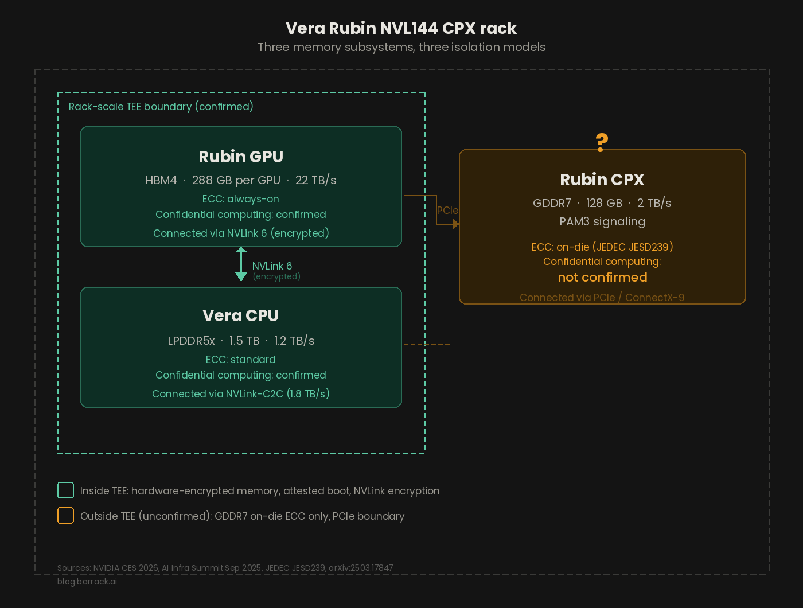

NVIDIA's Vera Rubin platform is the most security-forward GPU architecture the company has ever shipped. Rack-scale confidential computing across 72 GPUs and 36 CPUs. Encrypted NVLink 6. A custom Vera CPU with native TEE support, eliminating the x86 dependency that limited Hopper and Blackwell. On paper, Vera Rubin closes gaps that have existed in GPU security since the first CUDA kernel launched in 2007.

<!-- truncate -->

But the hardware security improvements are shipping into a software ecosystem that keeps producing critical container escape vulnerabilities every few months. Into a monitoring landscape where no major security vendor can see what a GPU is actually doing. And into a rack architecture that mixes three fundamentally different memory technologies with different isolation properties, different ECC implementations, and different positions relative to the confidential computing boundary.

These are the hardware unknowns and software gaps that matter before Vera Rubin systems reach cloud providers in H2 2026.

## Rubin CPX uses GDDR7. That memory type has never been tested for Rowhammer.

Most coverage of Vera Rubin focuses on the Rubin GPU, which uses HBM4. Fair enough. But the Vera Rubin NVL144 CPX rack also includes Rubin CPX, a specialized accelerator designed for million-token context processing. Rubin CPX uses 128 GB of GDDR7 memory on a 512-bit bus at 32 Gbps, delivering roughly 2 TB/s of bandwidth. NVIDIA announced Rubin CPX at the AI Infra Summit in September 2025, with availability expected at the end of 2026.

This is the first time NVIDIA has put GDDR memory into a data center GPU designed for multi-tenant cloud deployment.

That matters because of GPUHammer. Presented at USENIX Security 2025 by Chris S. Lin, Joyce Qu, and Gururaj Saileshwar at the University of Toronto, GPUHammer was the first demonstrated Rowhammer attack on discrete GPU memory. The target was an NVIDIA RTX A6000 with GDDR6. The researchers observed 8 distinct single-bit flips across all 4 tested DRAM banks using only user-level CUDA privileges. A single bit flip on an FP16 model weight exponent dropped ImageNet accuracy from roughly 80% to below 1%. The paper won the CSAW'25 Best Paper Award. NVIDIA responded with Security Notice: Rowhammer, published July 2025, recommending ECC enablement via nvidia-smi.

GDDR7 is structurally stronger than GDDR6 against this attack class. The JEDEC JESD239 standard, published March 5, 2024, mandates always-on on-die ECC (not optional like GDDR6), Data Poison flagging, Error Check and Scrub, Command Address Parity with Command Blocking, and CRC with Retry. The GPUHammer researchers addressed this directly. They noted that on-die ECC "likely masks single-bit flips" but warned that "future Rowhammer patterns causing multi-bit flips may bypass such ECC," citing the ECCploit attack as precedent. They recommended principled mitigations like PRAC rather than relying on ECC alone.

No published Rowhammer or side-channel research targeting GDDR7 or PAM3 signaling exists as of April 2026. The RTX 5090, the first consumer GPU with GDDR7, was mentioned but not tested in the GPUHammer paper.

So the situation is this: GDDR7's on-die ECC is a real improvement over GDDR6. But ECC detects and corrects errors. It does not prevent the underlying electrical disturbance that causes them. Rubin CPX is going into cloud data center racks where multiple tenants share physical infrastructure. The Rowhammer vulnerability profile of GDDR7 in that context is simply unknown.

## Three memory types, three isolation models, one rack

The Vera Rubin NVL144 CPX rack contains three distinct memory subsystems. Each has different security characteristics.

HBM4 on the Rubin GPU. 288 GB per GPU, roughly 22 TB/s bandwidth. Sits within the GPU's Compute Protected Region. Protected by the rack-scale TEE. Always-on ECC. HBM architectures showed no bit flips in GPUHammer testing (the A100 with HBM2e was tested and found resistant). Data flows through NVLink 6 at 3.6 TB/s per GPU, encrypted end-to-end in confidential computing mode.

GDDR7 on Rubin CPX. 128 GB per chip, roughly 2 TB/s. Has always-on on-die ECC per JEDEC JESD239. Connects via PCIe through ConnectX-9 rather than through the NVLink fabric. Whether GDDR7 on CPX falls inside or outside the confidential computing TEE boundary has not been confirmed in any published NVIDIA documentation as of April 2026.

LPDDR5x on the Vera CPU. Up to 1.5 TB per CPU, 1.2 TB/s bandwidth. Confirmed as protected within the CPU's TEE boundary. Connects to GPU memory through NVLink-C2C at 1.8 TB/s.

The interconnect between these memory subsystems is also a leakage vector. NVBleed (arXiv:2503.17847, March 2025, Yicheng Zhang et al., UC Riverside) demonstrated covert channels exceeding 70 Kbps and cross-VM side-channel attacks with F1 scores exceeding 88% on Google Cloud, all through NVLink contention timing. That research tested NVLink V1 and V2. Vera Rubin uses NVLink 6 with encrypted traffic, which addresses data confidentiality but does not inherently prevent contention-based timing observation.

Data moving between Rubin CPX (GDDR7, connected via PCIe) and Rubin GPU (HBM4, connected via NVLink) crosses a protocol boundary. If the CPX memory is outside the TEE, this creates a two-tier isolation architecture within a single rack. Some memory encrypted and attested, some not. That distinction matters for any deployment mixing standard Rubin inference with CPX-accelerated long-context workloads.

## Confidential computing reaches rack scale, with one open question

NVIDIA's confidential computing has improved significantly across three GPU generations. Hopper introduced it with AES-GCM-256 encryption on PCIe, but NVLink was unencrypted and it required x86 host CPUs. Blackwell added encrypted NVLink and multi-GPU CC across 8 GPUs, still x86-dependent. Vera Rubin is the first generation where everything lives in one trust domain: the Vera CPU has native CC support, the TEE spans all 72 Rubin GPUs and 36 CPUs, and the entire NVLink 6 fabric is encrypted. Published benchmarks on Hopper showed less than 7% overhead for LLM inference (arXiv:2409.03992v2, Phala Network, September 2024). NVIDIA claims Vera Rubin approaches "near-unencrypted" performance. No independent benchmarks exist yet because systems ship in H2 2026.

The open question is CPX. NVIDIA's CC documentation consistently describes the Vera Rubin NVL72 configuration (Rubin GPU plus Vera CPU). The NVL144 CPX configuration adds 144 Rubin CPX accelerators alongside 144 standard Rubin GPUs and 36 Vera CPUs. No published source confirms CC coverage extends to CPX's GDDR7. If it does not, the NVL144 CPX rack has a two-tier isolation architecture: some memory encrypted and attested, some not.

## No major security tool can see what a GPU is doing

RSA Conference 2026 ran March 23 to 26 in San Francisco with roughly 44,000 attendees. GPU security was a recurring theme. The core technical problem is architectural.

eBPF-based security tools, which are the industry standard for runtime monitoring, attach to kernel hooks associated with syscalls. When a CUDA kernel launches, the host OS sees a single opaque ioctl() call. Everything that happens after that on the GPU generates zero syscalls, zero interrupts, zero kernel context switches. Billions of GPU instructions, every VRAM access, every GPU-to-GPU NVLink transfer, all invisible to the host-side security stack.

This is not theoretical. CoffeeLoader malware, discovered in late 2024 and reported by Zscaler in March 2025, uses a GPU-based packer called Armoury that executes code on the system's GPU specifically to evade EDR and antivirus detection.

The Futurum Group 2H 2025 Cybersecurity Decision Maker Survey (n=1,008) found that 62.1% of respondents consider AI-powered defensive tools a necessity and 82.3% experienced at least one significant security incident in the prior 12 months. A February 2026 Futurum report specifically identified the GPU blind spot in the context of AI factory security.

The three biggest vendor announcements at RSA 2026 were Palo Alto Networks Prisma AIRS 3.0 (AI agent discovery and runtime governance), Cisco Zero Trust Access for AI Agents (non-human identity controls), and Wiz AI Application Protection (cross-platform AI infrastructure security). All three focused on the agent and application layer. None of them monitor GPU kernel execution or VRAM contents.

NVIDIA's own answer is DOCA Argus on BlueField DPUs, claiming 1,000x faster detection than agentless solutions. Validated partners include Trend Micro, Check Point, Palo Alto Networks, Cisco, Fortinet, Armis, and F5. But Argus monitors host-level processes and memory from a separate trust domain on the DPU. It does not inspect GPU compute operations. True GPU kernel-level monitoring remains limited to startups like Edera (backed by Microsoft M12 and In-Q-Tel, $20M total funding) and Stealthium.

The result: Vera Rubin will ship the most advanced GPU security hardware ever built, into a monitoring ecosystem that fundamentally cannot observe what runs on it.

## Container Toolkit: three CVSS 9.0 container escapes in ten months

The NVIDIA Container Toolkit is the software that connects GPUs to container environments. It runs on every GPU architecture. It will run on Rubin. And it keeps breaking in the same way.

CVE-2024-0132 (CVSS 9.0, September 2024). A TOCTOU race condition discovered by Wiz Research. A malicious container image could escape isolation and access the host filesystem. Affected roughly 33% of cloud environments. Fixed in Container Toolkit v1.16.2.

CVE-2025-23359 (CVSS 9.0, February 2025). Trend Micro discovered the previous patch was incomplete. The allow-cuda-compat-libs-from-container feature re-enabled the same vulnerability. Fixed in Container Toolkit v1.17.4.

CVE-2025-23266, also called NVIDIAScape (CVSS 9.0, July 2025). Discovered by Wiz researchers Nir Ohfeld and Shir Tamari, first demonstrated at Pwn2Own Berlin on May 17, 2025. The nvidia-ctk OCI hook runs as a privileged host process and inherits environment variables from the container image. An attacker sets LD_PRELOAD in a three-line Dockerfile and the privileged process loads a malicious shared library. Full root access on the host. Wiz stated that 37% of cloud environments had vulnerable resources. Fixed in Container Toolkit v1.17.8.

CVE-2025-33220 (CVSS 7.8, January 2026). A use-after-free in the vGPU Virtual GPU Manager enabling guest-to-host escape. Discovered by Sam Lovejoy and Valentina Palmiotti. Fixed in vGPU Software 19.4.

Three CVSS 9.0 container escapes in ten months. The Container Toolkit and vGPU Manager are not architecture-specific. They carry forward to every new GPU generation. Organizations planning Rubin deployments for H2 2026 should build patching workflows into their operational baseline from day one because the pattern shows no signs of slowing down.

## MIG isolation has a known bypass that remains unpatched

Multi-Instance GPU partitions a single GPU into up to 7 isolated instances. NVIDIA's MIG documentation describes "separate and isolated paths through the entire memory system." Rubin supports MIG, confirmed on NVIDIA's official product page.

Published research tells a different story.

"TunneLs for Bootlegging," presented at ACM CCS 2023 by Zhenkai Zhang, Tyler Allen, Fan Yao, Xing Gao, and Rong Ge, reverse-engineered GPU TLB structures on Turing and Ampere GPUs and found that MIG does not partition the last-level (L3) TLB. It is shared by all compute units across all MIG instances. Exploiting this, the researchers built a covert channel achieving 31 kbps exfiltration with roughly 99.8% accuracy on a commercial cloud platform, and could fingerprint applications running in other MIG instances via L3 TLB access patterns.

Follow-up work from Penn State ("Veiled Pathways," disclosed to NVIDIA February 2024) found additional unpartitioned resources: PCIe bandwidth, GPU DRAM frequency scaling, and hardware video encoders. Further research confirmed the TLB sharing issue in 2025.

No evidence exists that NVIDIA has fixed the L3 TLB sharing in Hopper, Blackwell, or Rubin. NVIDIA positions Confidential Computing as the answer for security-critical multi-tenant workloads. Their official MIG product page states that Blackwell and Hopper GPUs "securely isolate each instance with confidential computing at the hardware and hypervisor level." But in practice, a developer posted on NVIDIA's own forums in February 2026 that enabling CC on a Hopper GPU causes MIG to report as unsupported. The marketing says MIG and CC work together. The firmware says otherwise. Until that gap closes, you get multi-tenancy without hardware security, or hardware security without multi-tenancy. Not both.

## What this means if you are running workloads on cloud GPUs

The most important security question in GPU infrastructure for 2026 is not whether the silicon is secure. NVIDIA has answered that with rack-scale CC, on-die ECC, and encrypted NVLink. The silicon is the best it has ever been. The question is whether everything else can keep up.

Right now, it cannot. The Container Toolkit keeps producing critical escapes. MIG isolation has a known, unpatched bypass that NVIDIA's own marketing contradicts. No commercial security tool can observe GPU kernel execution. The CPX confidential computing boundary is undefined. And the monitoring ecosystem has a structural limitation that eBPF cannot solve.

None of these gaps are unique to any single cloud provider. They exist at the platform level, in NVIDIA's own software stack and in the security industry's tooling limitations.

If you are evaluating GPU infrastructure for sensitive workloads, there are concrete steps worth taking today. Enable ECC on any GDDR-based GPU, especially RTX A6000 and similar models, using nvidia-smi. Keep the NVIDIA Container Toolkit and vGPU Manager on the latest patched version at all times. Ask your GPU cloud provider whether they offer Confidential Computing instances. Understand that MIG provides performance isolation but not security isolation against a determined attacker. And track the Rubin CPX confidential computing boundary disclosure as NVIDIA publishes deployment documentation through H2 2026.

If your workloads run on H100s, H200s, or B200s, [barrack.ai](https://barrack.ai) provides on-demand access to these GPUs with per-minute billing, zero egress fees, and no long-term contracts.

## FAQ

**What memory type does Rubin CPX use?**

128 GB of GDDR7 on a 512-bit bus at 32 Gbps, delivering roughly 2 TB/s bandwidth. This is the first NVIDIA data center GPU to use GDDR memory instead of HBM.

**Has GDDR7 been tested for Rowhammer attacks?**

No. As of April 2026, no published security research has tested GDDR7 for Rowhammer or any other memory disturbance attack. The GPUHammer researchers tested GDDR6 (NVIDIA RTX A6000) and HBM2e (NVIDIA A100). GDDR7 has stronger built-in protections (always-on on-die ECC per JEDEC JESD239) but the underlying DRAM physics vulnerability has not been evaluated.

**Does NVIDIA Confidential Computing cover Rubin CPX's GDDR7 memory?**

This has not been confirmed. NVIDIA's CC documentation describes the Vera Rubin NVL72 (Rubin GPU plus Vera CPU). The NVL144 CPX configuration adds Rubin CPX accelerators that connect via PCIe rather than NVLink. No published source confirms or denies whether CPX GDDR7 falls inside the rack-scale TEE.

**Can security tools monitor GPU kernel execution?**

No mainstream security product monitors GPU kernel execution directly. eBPF-based tools see only the host-side ioctl() call that triggers a CUDA kernel launch. Everything that happens on the GPU after that is invisible. NVIDIA's DOCA Argus on BlueField DPUs monitors host-level processes, not GPU compute. GPU-level monitoring is currently limited to startups (Edera, Stealthium).

**Is MIG secure for multi-tenant workloads?**

MIG provides performance isolation but has a known security gap. Published research (ACM CCS 2023) demonstrated that MIG does not partition the last-level TLB, enabling covert channels and application fingerprinting across MIG instances. This has not been confirmed as fixed in Hopper, Blackwell, or Rubin. NVIDIA's official MIG page claims CC and MIG work together, but a developer on NVIDIA's forums reported in February 2026 that enabling CC on Hopper causes MIG to report as unsupported.

**What is NVBleed?**

NVBleed is a side-channel and covert-channel attack exploiting contention on NVIDIA's NVLink interconnect. Published in March 2025 by UC Riverside researchers, it was demonstrated on NVLink V1 (DGX-1) and V2 (Google Cloud). It does not leak memory contents directly but allows application fingerprinting and cross-VM information leakage through timing measurements. It has not been tested on NVLink 5 or 6.

**Are NVIDIA GPUs affected by LeftoverLocals?**

No. LeftoverLocals (CVE-2023-4969) affects AMD, Apple, Qualcomm, and Imagination Technologies GPUs. NVIDIA GPUs are confirmed not affected, likely due to memory clearing practices in place since at least 2014. This extends to all NVIDIA architectures including Rubin.

**How many critical container escape vulnerabilities has the NVIDIA Container Toolkit had?**

Three CVSS 9.0 container escape vulnerabilities in ten months: CVE-2024-0132 (September 2024), CVE-2025-23359 (February 2025), and CVE-2025-23266/NVIDIAScape (July 2025). An additional CVSS 7.8 vGPU escape (CVE-2025-33220) was disclosed in January 2026. The Container Toolkit is not architecture-specific and will carry forward to Rubin deployments.

**When does Vera Rubin ship?**

NVIDIA confirmed Rubin is in full production as of Q1 2026. Partner systems (AWS, Google Cloud, Microsoft Azure, Oracle, CoreWeave, Lambda, Nebius, Nscale) are expected to deploy Vera Rubin NVL72 instances in H2 2026. The Rubin CPX variant is expected at the end of 2026.
